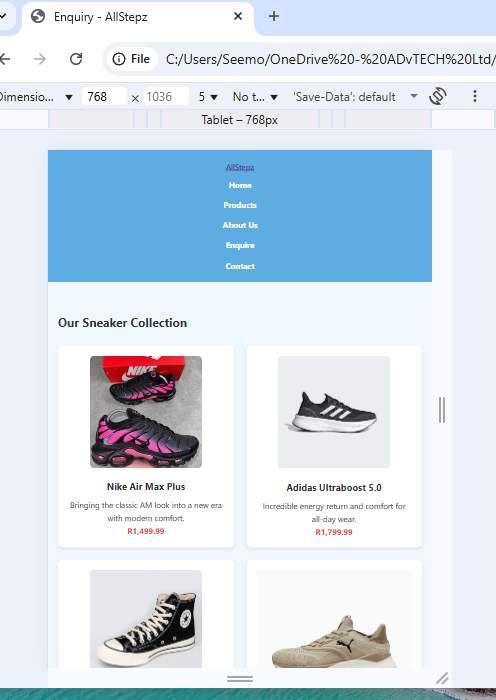

# AllStepz – Affordable Branded Shoes Website  

## Project Overview  
AllStepz is a *static website* designed to showcase affordable branded shoes.  
It consists of multiple HTML pages styled using CSS, with light blue as the main theme color.  

The website includes the following pages:  
- *Home*: Hero banner, featured shoes, highlights, and brand values.  
- *Products*: A catalog of branded sneakers with images, descriptions, and prices.  
- *About*: Company background, mission, vision, and team profiles.  
- *Enquiry*: Form for customers to submit product enquiries.  
- *Contact*: Store location, contact details, Google Maps integration, and a contact form.  

## Technologies Used  
- *HTML5* (semantic structure)  
- *CSS3* (styling and responsive design)  
- *Font Awesome* (icons)  
- *Google Maps Embed API* (location map)  

## File & Folder Structure
AllStepz/
│
├── index.html          # Homepage
├── about.html          # About page
├── products.html       # Products page
├── enquiry.html        # Enquiry form page
├── contact.html        # Contact page
│
├── css/
│   └── style.css       # Main stylesheet
│
├── assets/             # Images (shoes, team members, etc.)
│   ├── air force1.jpeg
│   ├── nike anime low dunk.jpeg
│   ├── member 1.jpeg
│   └── …
│
└── README.md           # Documentation
└── CHANGELOG.md        # Project changes

## Features  
- *Responsive navigation bar* with highlighted active page.  
- *Hero section* with background images and shoe highlights.  
- *Product grid* with hover effects.  
- *Forms* for enquiries and contact submissions.  
- *Reusable footer* with social media icons.  
- *Light blue theme* with accent highlights.  

## How to Run  
1. Download or clone this repository.  
2. Open index.html in your web browser.  
3. Navigate using the header menu.  

##  Future Improvements  
- Add JavaScript for form validation.  
- Integrate backend to handle enquiries and contacts.  
- Improve accessibility (ARIA labels, alt text refinements).  
- Enhance proposal content with clear business objectives.  

## Screenshots 0f media queries

## Author  
Molly Seemola 

## References 
	•	Font Awesome. (2025). Font Awesome Icons. Available at: https://fontawesome.com (Accessed: 25 September 2025).
	•	Google. (2025). Google Maps Embed API. Available at: https://developers.google.com/maps/documentation/embed (Accessed: 25 September 2025).
	•	W3Schools. (2025). HTML and CSS Tutorials. Available at: https://www.w3schools.com (Accessed: 25 September 2025).
	•	MDN Web Docs. (2025). HTML5 and CSS3 Documentation. Mozilla. Available at: https://developer.mozilla.org (Accessed: 25 September 2025).

